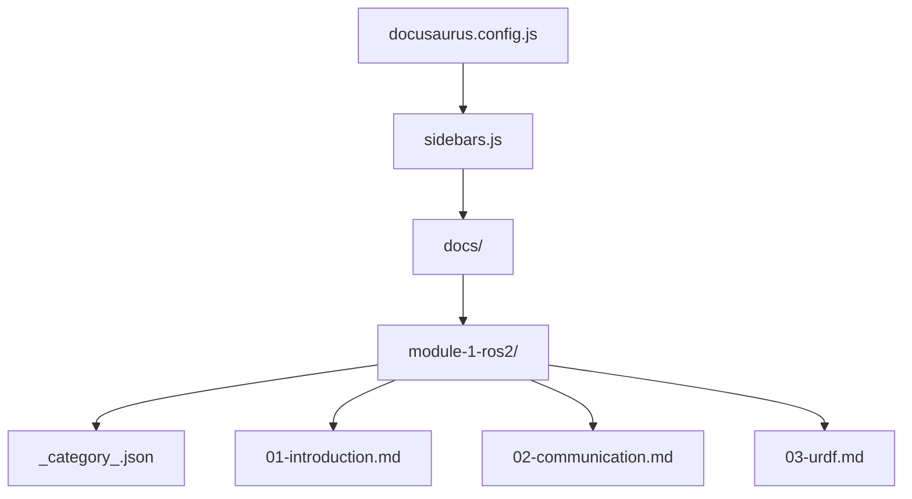

# Data Model: Module 1 - The Robotic Nervous System (ROS 2)

**Feature**: `001-ros2-module-1`
**Date**: 2025-12-29
**Purpose**: Define content structure and file schemas

---

## Content Entities

### 1. Docusaurus Project Configuration

**Entity**: `docusaurus.config.js`
**Location**: `book/docusaurus.config.js`

```javascript
{
  title: string,           // "AI/Spec-Driven Book with RAG Chatbot"
  tagline: string,         // "Learn humanoid robotics with AI"
  favicon: string,         // "img/favicon.ico"
  url: string,             // GitHub Pages URL
  baseUrl: string,         // Repository path
  organizationName: string,// GitHub username
  projectName: string,     // Repository name
  themeConfig: {
    navbar: NavbarConfig,
    footer: FooterConfig,
    prism: PrismConfig,
  },
  presets: PresetConfig[],
}
```

### 2. Sidebar Configuration

**Entity**: `sidebars.js`
**Location**: `book/sidebars.js`

```javascript
{
  docs: [
    {
      type: 'autogenerated',
      dirName: '.',
    },
  ],
}
```

### 3. Module Category

**Entity**: `_category_.json`
**Location**: `book/docs/module-1-ros2/_category_.json`

```json
{
  "label": "Module 1: The Robotic Nervous System",
  "position": 1,
  "collapsed": false,
  "collapsible": true,
  "description": "Introduction to ROS 2 for humanoid robotics"
}
```

### 4. Chapter Document

**Entity**: Chapter Markdown File
**Location**: `book/docs/module-1-ros2/[NN]-[slug].md`

**Frontmatter Schema**:
```yaml
---
sidebar_position: number    # Required: 1, 2, 3...
title: string               # Required: Chapter title
description: string         # Required: SEO description (max 160 chars)
tags: string[]              # Optional: ["ros2", "humanoid", "tutorial"]
---
```

**Content Structure**:
```markdown
## What You'll Learn

- [Learning objective 1]
- [Learning objective 2]
- [Learning objective 3]

## [Main Sections]

[Content with code examples]

## Key Takeaways

- [Summary point 1]
- [Summary point 2]
- [Summary point 3]

## Next Steps

[Link to next chapter or resources]
```

---

## File Inventory

### Module 1 Files

| File | Purpose | Frontmatter |
|------|---------|-------------|
| `_category_.json` | Module metadata | N/A (JSON) |
| `01-introduction.md` | Chapter 1: ROS 2 Intro | position: 1 |
| `02-communication.md` | Chapter 2: Communication | position: 2 |
| `03-urdf.md` | Chapter 3: URDF | position: 3 |

### Chapter Content Requirements

**Chapter 1: Introduction to ROS 2 for Physical AI**
- What ROS 2 is
- Why it matters for humanoids
- The "nervous system" analogy
- DDS concepts (publish-subscribe, QoS, discovery)
- ROS 1 vs ROS 2 comparison

**Chapter 2: ROS 2 Communication Model**
- Nodes as computational units
- Topics for async communication
- Services for sync communication
- rclpy publisher/subscriber example
- Agent controller flow example

**Chapter 3: Robot Structure with URDF**
- URDF purpose and structure
- Links and joints
- Humanoid robot example
- Loading in RViz
- Simulation readiness with Gazebo

---

## Validation Rules

### Frontmatter Validation

- `sidebar_position` MUST be unique within module
- `title` MUST be 5-80 characters
- `description` MUST be 50-160 characters (SEO optimal)
- `tags` SHOULD include at least one of: `ros2`, `humanoid`, `tutorial`

### Content Validation

- Every chapter MUST have "What You'll Learn" section
- Every chapter MUST have "Key Takeaways" section
- Every code block MUST have a `title` attribute
- Every code block MUST be followed by expected output or explanation
- All technical terms MUST be defined on first use

### Link Validation

- All internal links MUST be relative paths
- All external links MUST use HTTPS
- All links MUST be valid (verified by Docusaurus build)

---

## Relationships



**Dependencies**:
- `sidebars.js` references `docs/` directory
- `_category_.json` controls module display in sidebar
- Chapter files are ordered by `sidebar_position`
