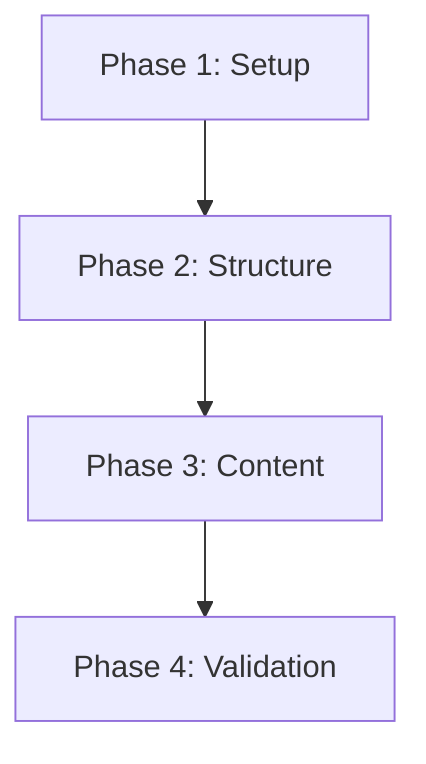

# Implementation Plan: Module 1 - The Robotic Nervous System (ROS 2)

**Branch**: `001-ros2-module-1` | **Date**: 2025-12-29 | **Spec**: [spec.md](./spec.md)
**Input**: Feature specification from `/specs/001-ros2-module-1/spec.md`

## Summary

Initialize a Docusaurus documentation site for the AI/Spec-Driven Book with Embedded RAG Chatbot. Create Module 1 containing three chapters about ROS 2 fundamentals as Markdown files, configure the sidebar navigation, and establish the book structure for future modules.

## Technical Context

**Language/Version**: Node.js 18+ (Docusaurus), Markdown for content
**Primary Dependencies**: Docusaurus 3.x (latest stable), React 18
**Storage**: Static files (Markdown), GitHub Pages hosting
**Testing**: Docusaurus build validation, link checking
**Target Platform**: Web (static site), GitHub Pages
**Project Type**: Static documentation site (Docusaurus)
**Performance Goals**: Page load < 3s, full build < 60s
**Constraints**: GitHub Pages compatible, Markdown-only content files
**Scale/Scope**: Module 1 (3 chapters), expandable to multiple modules

## Constitution Check

*GATE: Must pass before Phase 0 research. Re-check after Phase 1 design.*

| Principle | Requirement | Status |
|-----------|-------------|--------|
| I. Spec-First Workflow | Spec exists before implementation | ✅ PASS - spec.md created |
| II. Technical Accuracy | Content verified against official docs | ⏳ PENDING - applies during content writing |
| III. Clear Developer-Focused Writing | Active voice, bullet lists, expected outputs | ⏳ PENDING - applies during content writing |
| IV. Reproducible Setup & Deployment | Commands copy-paste ready, Docker optional | ✅ PASS - will include in quickstart |

**Technology Stack Compliance**:
| Component | Constitution Requirement | Plan Compliance |
|-----------|-------------------------|-----------------|
| Book Framework | Docusaurus (latest stable) | ✅ Docusaurus 3.x |
| Book Hosting | GitHub Pages | ✅ Configured for GH Pages |
| Content Format | Markdown (.md) | ✅ All chapters in .md |

**Gate Status**: ✅ PASS - proceeding to Phase 0

## Project Structure

### Documentation (this feature)

```text
specs/001-ros2-module-1/
├── spec.md              # Feature specification
├── plan.md              # This file
├── research.md          # Phase 0: Docusaurus best practices
├── data-model.md        # Phase 1: Content structure model
├── quickstart.md        # Phase 1: How to run locally
└── checklists/
    └── requirements.md  # Spec validation checklist
```

### Source Code (repository root)

```text
book/                           # Docusaurus project root
├── docusaurus.config.js        # Site configuration
├── sidebars.js                 # Sidebar navigation
├── package.json                # Node dependencies
├── docs/                       # Documentation content
│   └── module-1-ros2/          # Module 1: ROS 2 Nervous System
│       ├── _category_.json     # Module metadata
│       ├── 01-introduction.md  # Chapter 1: Introduction to ROS 2
│       ├── 02-communication.md # Chapter 2: Communication Model
│       └── 03-urdf.md          # Chapter 3: Robot Structure with URDF
├── src/                        # Custom React components (if needed)
│   └── components/
├── static/                     # Static assets (images, files)
│   └── img/
└── blog/                       # (optional, can be disabled)
```

**Structure Decision**: Using Docusaurus default structure with `docs/` for content. Each module is a folder containing numbered chapter files. This enables:
- Automatic sidebar generation from folder structure
- Clean URLs: `/docs/module-1-ros2/introduction`
- Easy expansion for future modules

## Complexity Tracking

> No constitution violations to justify.

---

## Phase 0: Research

### Research Tasks

1. **Docusaurus 3.x Setup Best Practices**
   - Official installation method
   - GitHub Pages deployment configuration
   - Sidebar configuration patterns

2. **ROS 2 Official Documentation Sources**
   - ROS 2 Humble documentation URLs
   - DDS specification references
   - URDF documentation sources

3. **Content Structure Patterns**
   - Docusaurus frontmatter requirements
   - MDX vs pure Markdown tradeoffs
   - Code block syntax highlighting for Python/XML

See [research.md](./research.md) for consolidated findings.

---

## Phase 1: Design

### Content Model

See [data-model.md](./data-model.md) for:
- Chapter frontmatter schema
- Module category configuration
- Sidebar structure specification

### Quickstart

See [quickstart.md](./quickstart.md) for:
- Local development setup
- Build and preview commands
- Deployment to GitHub Pages

---

## Implementation Phases

### Phase 1: Project Setup (Blocking)

1. Initialize Docusaurus project in `book/` directory
2. Configure `docusaurus.config.js` for project metadata
3. Configure GitHub Pages deployment settings
4. Set up sidebar configuration in `sidebars.js`

### Phase 2: Module 1 Structure

1. Create `docs/module-1-ros2/` directory
2. Create `_category_.json` for module metadata
3. Create chapter files with frontmatter:
   - `01-introduction.md`
   - `02-communication.md`
   - `03-urdf.md`

### Phase 3: Content Development

1. Write Chapter 1: Introduction to ROS 2 for Physical AI
2. Write Chapter 2: ROS 2 Communication Model (with rclpy examples)
3. Write Chapter 3: Robot Structure with URDF (with humanoid example)

### Phase 4: Validation

1. Run Docusaurus build to verify no errors
2. Test all internal links
3. Verify code examples are syntactically correct
4. Preview locally before deployment

---

## Dependencies



- Phase 2 depends on Phase 1 (Docusaurus must exist)
- Phase 3 depends on Phase 2 (chapter files must exist)
- Phase 4 depends on Phase 3 (content must exist to validate)

---

## Risks & Mitigations

| Risk | Impact | Mitigation |
|------|--------|------------|
| Docusaurus version incompatibility | Build failures | Pin to specific version in package.json |
| ROS 2 code examples outdated | Reader frustration | Verify against Humble LTS docs |
| GitHub Pages build fails | Site not deployed | Test build locally before push |

---

## Next Steps

After `/sp.plan` completes:
1. Run `/sp.tasks` to generate actionable task list
2. Execute tasks in dependency order
3. Validate with local Docusaurus build
